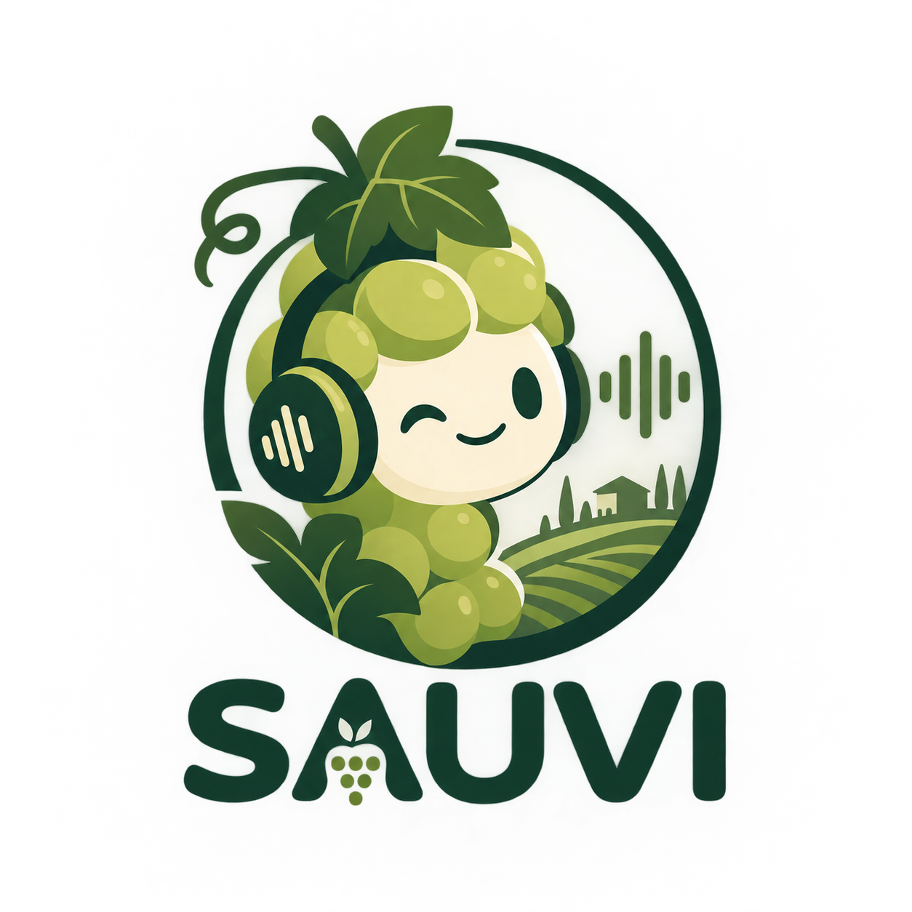

# SAUVI: An In-depth Vietnamese Spoken Language Understanding and Reasoning Benchmark

<p align="center">
  
</p>

SAUVI is a benchmark for evaluating Large Audio Language Models (LALMs) on
**Vietnamese spoken language understanding and reasoning**. It spans speech and
music perception, reasoning over spoken content, Vietnamese-specific phenomena
(dialects, reduplication, kinship pronouns, code-switching, ...), and more.

> **Paper status:** SAUVI has been submitted to **ICASSP 2027**. The full
> benchmark will be released if the paper is accepted.

This repository provides the evaluation pipeline and a small sample
(`data/testmini.jsonl`) for development and debugging.

## Sample Data

| File | Content |
|---|---|
| `data/testmini.jsonl` | 135 multiple-choice items |
| `data/audio/speech/` | Speech clips (`.wav`) |
| `data/audio/music/` | Music clips (`.wav`) |

The sample covers **27 sub-tasks** across `speech` and `music` tasks, split into
`perception` and `reasoning` categories, and `general` vs `vietnamese-specific`
types.

Each line is one JSON object:

```json
{
  "id": "speech-vdi-000001",
  "audio_id": "audio/speech/audio_ebc41f40fde941530071.wav",
  "question": "Người nói trong đoạn audio sử dụng giọng vùng nào?",
  "choices": ["bắc", "nam", "trung"],
  "answer": "bắc",
  "dataset": "ViMD",
  "task": "speech",
  "split": "test",
  "type": "vietnamese-specific",
  "category": "perception",
  "sub-category": "vietnamese dialect identification",
  "difficulty": "easy"
}
```

> ⚠️ **Running the sample:** `audio_id` paths are relative, and `run_lalm.py`
> resolves them against the current working directory. Run the pipeline from
> inside `data/` so `audio/speech/...` resolves correctly, e.g.
> `cd data && python ../run_lalm.py --manifest testmini.jsonl ...`.

## Project Structure

```
Benchmark/
├── run_lalm.py                 # Stage 1: query LALM, enrich manifest
├── toy_llm_server.py           # Mock LALM server for testing (port 8902)
├── toy_judge_server.py         # Mock judge server for testing (port 8903)
├── call.sh                     # Manual curl example
├── serve_instruct.sh           # Launch vLLM server (port 8901)
├── data/
│   ├── testmini.jsonl          # Sample manifest
│   └── audio/                  # Sample audio (speech/, music/)
├── images/
│   └── SAUVI.png               # Mascot
├── evaluation/
│   ├── llm_judge.py            # Stage 2: judge responses with an LLM
│   └── calculate_acc.py        # Stage 3: compute accuracy
├── utils/
│   └── common.py               # Shared JSONL loader
├── requirements.txt
└── README.md
```

## Prerequisites

```bash
pip install -r requirements.txt
```

## Pipeline Overview

```
[0] Start LALM server
         │
[1] run_lalm.py                 ──> <model_name>.jsonl
         │
[2] evaluation/llm_judge.py     ──> <model_name>_judgements.jsonl
         │
[3] evaluation/calculate_acc.py ──> accuracy
```

## Step-by-Step Usage

### Stage 0: Start the LALM Server

For production (real model, 2x GPU):

```bash
bash serve_instruct.sh
# Serves Qwen3-Omni-30B on http://127.0.0.1:8901
```

For testing (no GPU needed):

```bash
python toy_llm_server.py --port 8902
```

### Stage 1: Run the LALM

Query the model for each item in a JSONL manifest. Builds an instruction string
(`question? (a) choice_a (b) choice_b ...`, with shuffled option order), sends it
to the model via an OpenAI-compatible API, and writes enriched output.

```bash
# With the real model (run from data/ so relative audio paths resolve)
cd data
python ../run_lalm.py \
  --manifest testmini.jsonl \
  --endpoint http://127.0.0.1:8901/v1/chat/completions \
  --model Qwen3-Omni-30B-A3B-Instruct \
  --threads 8 \
  --output Qwen3-Omni-30B-A3B-Instruct.jsonl

# With the toy server (for debugging)
python ../run_lalm.py \
  --manifest testmini.jsonl \
  --endpoint http://127.0.0.1:8902/v1/chat/completions \
  --model toy-model \
  --threads 8
```

**Output format** (JSONL, one item per line — original fields plus
`instruction`, `label`, `response`):

```json
{
  "id": "speech-vdi-000001",
  "audio_id": "audio/speech/audio_ebc41f40fde941530071.wav",
  "question": "Người nói trong đoạn audio sử dụng giọng vùng nào?",
  "choices": ["bắc", "nam", "trung"],
  "answer": "bắc",
  "instruction": "Người nói trong đoạn audio sử dụng giọng vùng nào? (a) trung (b) bắc (c) nam",
  "label": "(b) bắc",
  "response": "The answer is (b) bắc."
}
```

### Stage 2: Judge Responses

Send each item to an LLM judge (GPT-4o or a local model) to decide whether the
response is correct. Adds `Explanation` and `Judgement` keys to each item.

```bash
# With real OpenAI (run from the repo root)
python evaluation/llm_judge.py \
  -i data/Qwen3-Omni-30B-A3B-Instruct.jsonl \
  -o results/ \
  --api_key YOUR_OPENAI_API_KEY

# With the toy judge server (for debugging)
python evaluation/llm_judge.py \
  -i data/Qwen3-Omni-30B-A3B-Instruct.jsonl \
  -o results/ \
  --api_key dummy \
  --base_url http://127.0.0.1:8903/v1 \
  --judge_model dummy
```

**Output format** (JSONL, same fields plus `Explanation`/`Judgement`):

```json
{
  "instruction": "...",
  "response": "The answer is (b) bắc.",
  "label": "(b) bắc",
  "Explanation": "The model chose (b) bắc which matches the ground truth (b) bắc.",
  "Judgement": "correct"
}
```

If the judge fails to parse the response, `Explanation` and `Judgement` are set
to `null`. These items require manual verification.

### Stage 3: Calculate Accuracy

```bash
python evaluation/calculate_acc.py -i results/Qwen3-Omni-30B-A3B-Instruct_judgements.jsonl
```

Output:

```
Correct count: 750
Incorrect count: 230
Invalid judgement for id: ...
Total count: 1000
Accuracy: 76.53%
```

## Toy Servers for Debugging

Two mock servers let you test the full pipeline without a real model or an
OpenAI API key.

### Toy LLM Server (port 8902)

Parses the `(a) ... (b) ...` options from the prompt and picks one randomly.

```bash
python toy_llm_server.py --port 8902
```

### Toy Judge Server (port 8903)

Extracts the ground-truth letter and the model-response letter, compares them,
and returns `correct`/`incorrect` with an explanation.

```bash
python toy_judge_server.py --port 8903
```

### Full Debug Pipeline

Open 3 terminals:

```bash
# Terminal 1: toy LLM
python toy_llm_server.py --port 8902

# Terminal 2: toy judge
python toy_judge_server.py --port 8903

# Terminal 3: run the pipeline on the SAUVI sample
cd data
python ../run_lalm.py \
  --manifest testmini.jsonl \
  --endpoint http://127.0.0.1:8902/v1/chat/completions \
  --model toy-model

python ../evaluation/llm_judge.py \
  -i toy-model.jsonl \
  -o ../results/ \
  --api_key dummy \
  --base_url http://127.0.0.1:8903/v1

python ../evaluation/calculate_acc.py -i ../results/toy-model_judgements.jsonl
```

## CLI Reference

### run_lalm.py

| Flag | Default | Description |
|---|---|---|
| `--manifest` | `regional_dialect_recognition.jsonl` | Input JSONL manifest |
| `--endpoint` | `http://127.0.0.1:8901/v1/chat/completions` | LALM API endpoint |
| `--model` | Qwen3-Omni path | Model name sent in payload |
| `--threads` | `8` | Concurrent worker threads |
| `--max-tokens` | `512` | Max tokens in response |
| `--timeout` | `120` | HTTP timeout (seconds) |
| `--retries` | `2` | Retries with exponential backoff |
| `--output` | `<model_name>.jsonl` | Output JSONL path |

> Tip: the `--manifest` default is a legacy path. Always pass
> `--manifest data/testmini.jsonl` (or `testmini.jsonl` when running from `data/`).

### evaluation/llm_judge.py

| Flag | Default | Description |
|---|---|---|
| `--input` / `-i` | (required) | Input JSONL file |
| `--output_dir` / `-o` | (required) | Output directory |
| `--api_key` | `$OPENAI_API_KEY` | OpenAI API key |
| `--judge_model` | `gpt-4o-2024-11-20` | Judge model name |
| `--base_url` | `None` (real OpenAI) | Base URL for an OpenAI-compatible API |
| `--output_name` | `<stem>_judgements.jsonl` | Output filename |

### evaluation/calculate_acc.py

| Flag | Default | Description |
|---|---|---|
| `--input` / `-i` | (required) | Input JSONL with a `Judgement` field |

## Data Format

### SAUVI Manifest Schema

JSONL, one object per line:

```json
{
  "id": "speech-vdi-000001",
  "audio_id": "audio/speech/audio_ebc41f40fde941530071.wav",
  "question": "Người nói trong đoạn audio sử dụng giọng vùng nào?",
  "choices": ["bắc", "nam", "trung"],
  "answer": "bắc",
  "dataset": "ViMD",
  "task": "speech",
  "split": "test",
  "type": "vietnamese-specific",
  "category": "perception",
  "sub-category": "vietnamese dialect identification",
  "difficulty": "easy"
}
```

| Field | Description |
|---|---|
| `id` | Unique item identifier |
| `audio_id` | Path to the audio file (relative to the working directory) |
| `question` | Vietnamese question text |
| `choices` | List of option texts |
| `answer` | The correct option (matches one entry in `choices`) |
| `dataset` | Source dataset name |
| `task` | `speech` or `music` |
| `split` | Dataset split (e.g. `test`, `music-test`) |
| `type` | `general` or `vietnamese-specific` |
| `category` | `perception` or `reasoning` |
| `sub-category` | Fine-grained task (e.g. `vietnamese dialect identification`) |
| `difficulty` | `easy`, `medium`, or `hard` |

### Audio Paths

`run_lalm.py` converts audio paths to `file://` URLs. Absolute paths are used
as-is; relative paths are resolved against the current working directory. Because
the SAUVI sample uses paths like `audio/speech/...`, run the pipeline from
inside `data/` (or rewrite `audio_id` to an absolute path).
